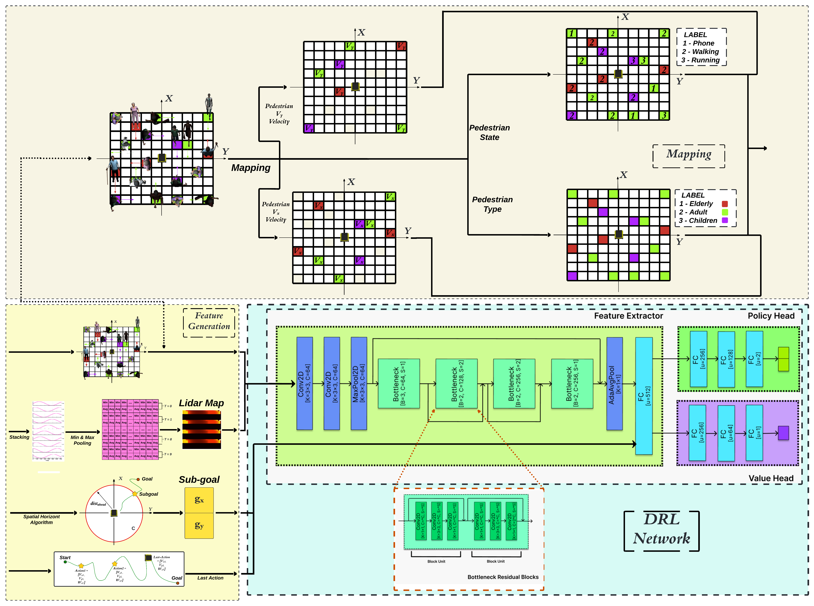
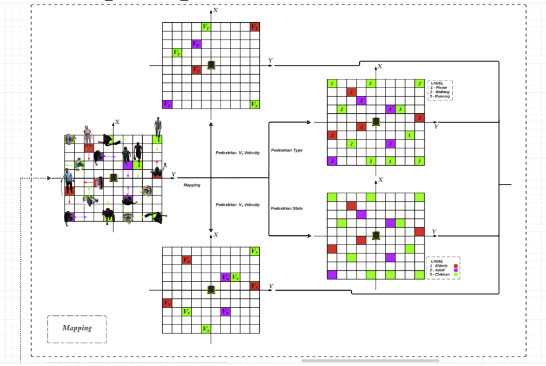

# Rosnav-RL - Reinforcement Learning Framework for Robotic Navigation

This is the official **Rosnav-RL** package. The Rosnav-RL framework enables training and deployment of 
deep reinforcement learning planners for autonomous robot navigation. It provides a highly-modular, flexible and unified
interface for defining an agent with a neural network, reward function, action and observation space. The framework is
intended to facilitate multiple reinforcement learning libraries for the application on learning-based navigation systems for mobile robots in ROS.

Rosnav is especially designed to run in the **arena-rosnav**
environment. That means, it is training in there and the
evaluation of rosnav is already implemented in both the
2D and the 3D **arena-rosnav** derivates.

## Structure

The **Rosnav** package contains multiple different pretrained
neural networks for a bunch of robots. It also contains
encoders to integrate the models into existing infrastructures
with ease. It **does not** contain the necessary complete
infrastructure to train models, though, one can use
[arena-rosnav](https://github.com/Arena-Rosnav/arena-rosnav) to train a new model.

RL-Agent contains the following submodules:
### Model

### Spaces

### Reward

Additional submodules are:
### Observations

### States

### Action-Server

