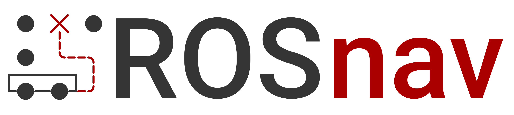
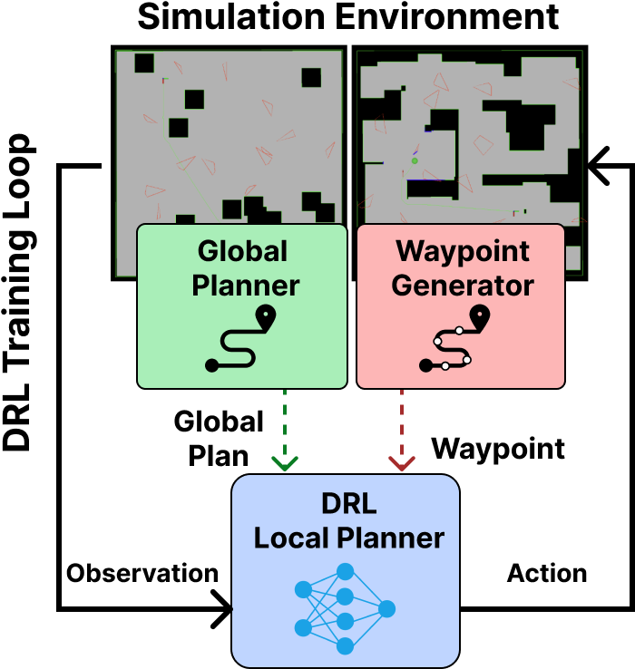
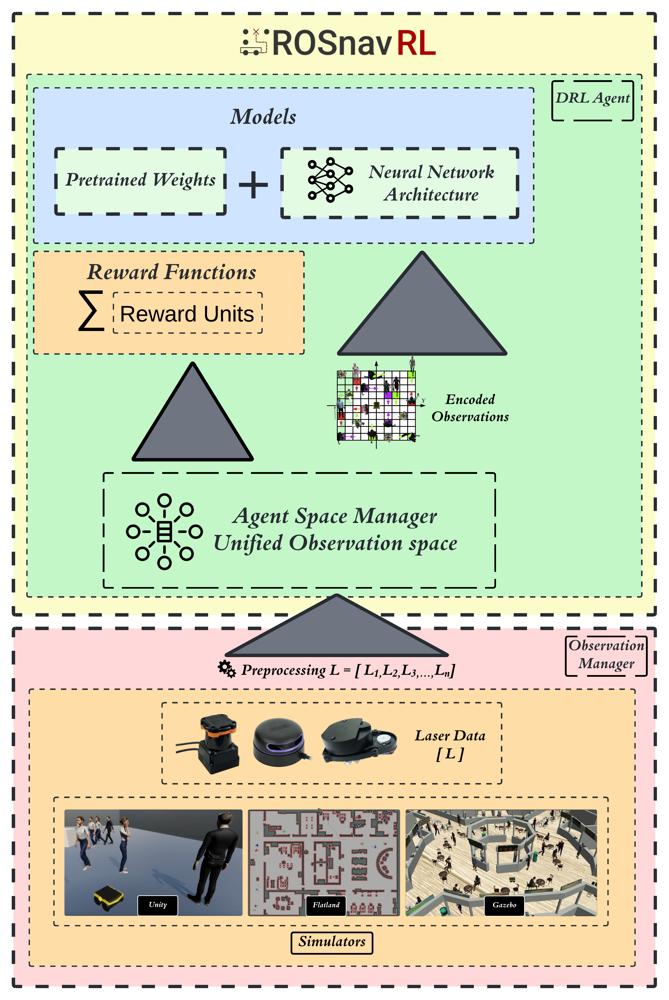

# RosNav-RL Developer Guide




## Table of Contents
1. [Executive Summary](#1-executive-summary)
    1. [Project Purpose](#project-purpose)
    2. [Main Technologies](#main-technologies)
    3. [Key Features](#key-features)
2. [Project Architecture](#2-project-architecture)
    1. [High-Level Overview](#high-level-overview)
    2. [Key Components](#key-components)
    3. [Data Flow](#data-flow)
3. [Setup & Installation](#3-setup--installation)
    1. [Prerequisites](#prerequisites)
    2. [Environment Setup](#environment-setup)
4. [Code Organization](#4-code-organization)
    1. [Directory Structure](#directory-structure)
5. [Core Concepts and Abstractions](#5-core-concepts-and-abstractions)
    1. [Main Agent Interface](#main-agent-interface)
    2. [Model Interface](#model-interface)
    3. [Agent Spaces and Observation Management](#agent-spaces-and-observation-management)
    4. [Reward System](#reward-system)
    5. [State Management](#state-management)
    6. [Deployment](#deployment)
6. [Development Workflow](#6-development-workflow)
    1. [Deployment](#deployment)
    2. [Training](#training)
7. [Common Tasks](#7-common-tasks)
    1. [Adding New RL-Framework](#adding-new-rl-framework)
    2. [Training New Agent](#training-new-agent)
    3. [Adding New Observation Space](#adding-new-observation-space)
    4. [Adding New Reward Component](#adding-new-reward-component)
    5. [Adding New Observation Unit](#adding-new-observation-unit)
    6. [Adding New Model Architectures](#adding-new-model-architectures)

    [Best Practices](#best-practices)

## 1. Executive Summary

### Project Purpose
This is the official **Rosnav-RL** package. The Rosnav-RL framework provides tools to construct a
deep reinforcement learning agent for autonomous robot navigation, straight-forward development of a training pipeline and further testing across different platforms. 
It provides a highly-modular, flexible and unified interface for defining an agent with a neural network, reward function, action and observation space. 
The configuration layout provides a wide range of settings to encourage experimentation. The framework is
intended to facilitate multiple reinforcement learning libraries for the application on learning-based navigation systems for mobile robots in ROS1.

Rosnav-RL was initially developed for the [Arena-Rosnav](https://github.com/Arena-Rosnav/arena-rosnav) environment, which is a simulation platform for training and evaluating navigation systems. 
Though, the framework can be easily integrated into other simulation environments. 



### Main Technologies
- ROS 1 (Robot Operating System)
- Python 3
- StableBaselines 3 (RL framework)
- PyTorch (Deep Learning)

### Key Features
- **Flexible Infrastructure**: Framework-agnostic design supporting multiple reinforcement learning backends for model development
- **Modular Design**: Clean separation between network architecture building blocks, allowing straightforward customization and extension
- **Unified Encoding**: Standardized observation and action space management across different navigation tasks and robot configurations.
- **Robust Configuration**: Pydantic-based configuration management providing automatic validation, schema documentation, serialization support
- **Observation Handling**: Modular observation management for easy integration of new observation types and seamless data collection
- **Neural Networks and Reward Functions**: Extensivly-tested neural network architectures and reward functions for quick agent development
- Deployment-ready ROS action server for seamless agent deployment


## 2. Project Architecture

### High-Level Overview
The system is built around a modular reinforcement learning architecture that separates concerns between:
- Reinforcement Learning Framework
- Agent-specific Space Management
- Reward Calculation
- Observation Handling
- Centralized Parameter Management

### Key Components


```
RosNav-RL
├── RL Agent
│   ├── Model Architecture
│   ├── Space Manager (Action-/ Observation Space Manager)
│   └── Reward Function
├── Observations
│   ├── Observation Manager
│   └── Observation Units
└── States
    ├── Agent State Container
    └── Simulation State Container
```

### Data Flow



| Stage | Component | Function |
|-------|-----------|----------|
| 1. Input | Observations Dictionary | Raw data collection |
| 2. Processing | Observation Manager | Data handling |
| | (Observation) Space Manager | Space-specific transformation |
| 3. Decision | Model (Feature Extractors) | Feature engineering |
| | Model (Policy Network) | Action selection |
| 4. Output | (Action) Space Manager | Command preparation |
| 5. Execution | Robot Commands | Physical/ simulated execution |


## 3. Setup & Installation

### Prerequisites

- Working ROS Noetic installation
- Python 3.8+
- Poetry

### Environment Setup
Single-package installation:
```bash
# Clone repository
git clone https://github.com/your-org/rosnav-rl.git
cd rosnav-rl

# Install dependencies
poetry install
```
Add to existing workspace:
```bash
# Clone repository
git clone https://github.com/your-org/rosnav-rl.git

# Navigate to workspace
cd *path-to-workspace*
poetry add *path-to-rosnav-rl*
```

## 4. Code Organization

### Directory Structure
```
agents/             # Agent storage
launch/             # ROS launch files
reward/             # Reward functions
rosnav_rl/
├── action_server/    # ROS action server implementation
├── cfg/             # Configuration management
├── model/           # RL model implementations
├── observations/    # Observation handling
├── reward/         # Reward system
├── spaces/         # Action and observation spaces
├── states/         # State management
└── utils/          # Utility functions
```

## 5. Core Concepts and Abstractions


#### Main Agent Interface
- Core component in [`rosnav_rl/rl_agent.py`](rosnav_rl/rl_agent.py)
- Coordinates interaction between Model, Space Manager and Reward Function
- Provides main interface for Reinforcement Learning

```python
class RL_Agent:
    def __init__(self, agent_cfg: AgentCfg, agent_state_container: AgentStateContainer):
        self._model = self.initialize_model()
        self._space_manager = self._initialize_space_manager()
        self._reward_function = self._initialize_reward_function()

    def train(self, *args, **kwargs):
        # Calls self._model.train() and trains the agent

    def get_action(self, observation: ObservationDict) -> np.ndarray:
        # Get action from model
```

#### Model Interface
- Implemented in [`rosnav_rl/model/model.py`](rosnav_rl/model/model.py)
- Encapsulates neural network and its framework-specific logic
- Responsible for training, saving and loading the model

```python

class RL_Model:
    @abstractmethod
    def setup_model(self, *args, **kwargs):
        pass

    @abstractmethod
    def train(self, *args, **kwargs):
        raise NotImplementedError()

    @abstractmethod
    def save(self, *args, **kwargs):
        pass

    @abstractmethod
    def load(self, *args, **kwargs):
        pass

    @abstractmethod
    def get_action(self, observation: "EncodedObservationDict", *args, **kwargs):
        pass
```

#### Agent Spaces and Observation Management
- Space Manager in [`rosnav_rl/spaces/space_manager/base_space_manager.py`](rosnav_rl/spaces/space_manager/base_space_manager.py)
- Action Space Manager in [`rosnav_rl/spaces/action_space/action_space_manager.py`](rosnav_rl/spaces/action_space/action_space_manager.py)
- Observation Space Manager in [`rosnav_rl/spaces/observation_space/observation_space_manager.py`](rosnav_rl/spaces/observation_space/observation_space_manager.py)
- Observation Manager in [`rosnav_rl/observations/observation_manager.py`](rosnav_rl/observations/observation_manager.py)


**Base Space Manager**
- Processes agent observations and actions
- Converts between different representations

```python
class BaseSpaceManager:
    def encode_observation(
        self, obs_dict: ObservationDict, *args, **kwargs
    ) -> EncodedObservationDict:
        pass

    def decode_action(self, action: np.ndarray) -> np.ndarray:
        pass
```

**Observation Space Manager**
- An agent observation space is made up of multiple observation space units - each responsible for a specific observation type and its processing

```python

class ObservationSpaceManager:
    _space_cls_list: ObservationSpaceList | Union[Type[BaseObservationSpace]]
    _observation_space: spaces.Dict

    def encode_observation(
        self, observation: ObservationDict, *args, **kwargs
    ) -> EncodedObservationDict:
        # Retrieve observation and encode based on observation spaces
```

**Observation Spaces**
- Modular observation space component that can be combined to form an observation space
```python
class BaseObservationSpace:
    name: ClassVar[str]
    required_observation_units: ClassVar[
        List[Union[ObservationCollector, ObservationGenerator]]
    ] = []

    @property
    def space(self) -> spaces.Space:
        """
        Get the gym.Space object representing the observation space.
        """
        return self._space

    @abstractmethod
    def encode_observation(self, observation: ObservationDict) -> np.ndarray:
        pass
```

##### Observation Management

- Observation Manager in [`rosnav_rl/observations/observation_manager.py`](rosnav_rl/observations/observation_manager.py)
- Manages observation collection and generation

```python
class ObservationManager:
    _collectors: Dict[str, ObservationCollectorUnit]
    _generators: Dict[str, ObservationGeneratorUnit]

    def get_observations(
        self,
        *args,
        **extra_observations: ObservationDict,
    ) -> ObservationDict:
    # Collect and generate observations
```

**ObservationCollectorUnits**
- Implemented in [`rosnav_rl/observations/observation_collector_unit.py`](rosnav_rl/observations/collectors/base_collector.py)
- Collects observations from ROS topics and preprocesses them
- Modular structure through Observation Units
- Name, topic, and message type are defined in the class definition

```python
class ObservationCollectorUnit(
    BaseUnit, Generic[MessageType, ProcessedObservationType], ABC
):
    name: ClassVar[str]
    topic: ClassVar[str]
    msg_data_class: ClassVar[Type[MessageType]]
    data_class: ClassVar[Type[ProcessedObservationType]] = ProcessedObservationType

    def preprocess(self, msg: MessageType) -> ProcessedObservationType:
        # Preprocess message and return observation
```

**ObservationGeneratorUnits**
- Implemented in [`rosnav_rl/observations/generators/base_generator.py`](rosnav_rl/observations/generators/base_generator.py)
- Generates observations from collected data
- Name, required observation units, data type of the generated data and observation generation logic are defined in the class definition

```python
class ObservationGeneratorUnit(BaseUnit, Generic[GeneratedDataType], ABC):
    name: ClassVar[str]
    requires: ClassVar[List[BaseUnit]]
    data_class: Type[GeneratedDataType]

    def generate(
        self,
        obs_dict: dict,
        simulation_state_container: SimulationStateContainer,
        *args,
        **kwargs,
    ) -> GeneratedDataType:
        # Generate observation based on collected data
```

#### Reward System
- Reward Function in [`rosnav_rl/reward/reward_function.py`](rosnav_rl/reward/reward_function.py)
- Calculates rewards based on actions and states
- Modular structure through Reward Units

```python
class RewardFunction:
    self._reward_units: List[RewardUnit]
    
    def calculate_reward(self, obs_dict: ObservationDict, simulation_state_container: SimulationStateContainer):
        # Calculate reward based on current observation and state
```

**Reward Units**
- Modular reward components that be combined to form a reward function
```python
class RewardUnit(ABC):
    def add_reward(self, value: float):
    ...

    @abstractmethod
    def __call__(self, obs_dict: ObservationDict, state_container: SimulationStateContainer, *args, **kwargs):
        # Logic for calculating reward then calls add_reward()
```

#### State Management
- Agent States in [`rosnav_rl/states/agent/container.py`](rosnav_rl/states/agent/container.py)
- Simulation States in [`rosnav_rl/states/simulation/container.py`](rosnav_rl/states/simulation/container.py)
- Manages state of agent and simulation environment

#### Deployment
- Action Server in [`rosnav_rl/action_server/base_server.py`](rosnav_rl/action_server/base_server.py)
- Enables deployment of trained agents
- Provides ROS interface

## 6. Development Workflow

### Deployment
<!-- Maybe implement roslaunch, refer to action server -->
When using the Rosnav-RL Action Server, the agent seamlessly integrates into the ROS infrastructure. The action server is responsible for handling the communication between the agent and the ROS environment.
Observations are collected and passed to the agent, which then returns an action to be executed by the robot. One needs to make sure that the `ObservationUnit` of the `observations`-module has the right topics and message types to collect the necessary data.
The action has to be requested via an external service on `/rosnav_rl/get_action`. We provide a simple launch file to start the action server.


```python
import rospy
from rosnav_rl.srv import GetAction, GetActionRequest

rospy.wait_for_service(f"{self.ns}/rosnav_rl/get_action")
self._get_action_srv = rospy.ServiceProxy(
    f"{self.ns}/rosnav_rl/get_action", GetAction
)

action = self._get_action_srv(GetActionRequest()).action
```

### Training
1. Choose a simulator environment.
2. Derive an Environment class from `gym.Env` and implement the necessary methods using the provided interfaces:
    - `BaseSpaceManager`: Preprocess observations for the model and decode actions for the environment.
    - `ObservationManager`: Subscribe to topics and collect / generate observations.
    - `RewardFunction`: Calculate rewards based on observations and state.
3. Instantiate the `SimulationStateContainer` with the necessary parameters. The `AgentStateContainer` is derived from it via `.to_agent_state_container()` and holds space-specific parameters.
4. Initialize the agent with desired configuration and the `AgentStateContainer`. Train it using the new environment. 

> Note: One needs to make sure that the `ObservationUnits` of the `observations`-module has the right topics and message types to collect the necessary data.
## 7. Common Tasks

Module Guide for common tasks and extensions can also be found in the submodules:
- [Reward Functions](rosnav_rl/reward/reward_functions.md)
- [Observation Spaces](rosnav_rl/spaces/spaces.md)

### Adding New RL-Framework
1. Implement a new RL_Model while inheriting the base class. Implement the necessary methods for training, saving, loading and action selection.
2. Implement your new architectures. Define the required observation spaces for the model.
3. Define new configuration files encapsulating all settings of the new framework with pydantic
4. For deployment, inheret a new action server for the new framework.

### Training New Agent
For a working integration into a training pipeline check out the [Arena](https://github.com/Arena-Rosnav/arena-rosnav) repository with its [documentation](https://arena-rosnav.readthedocs.io/en/latest/). 

```python
from rosnav_rl import RL_Agent
from rosnav_rl.cfg import AgentCfg, StableBaselinesCfg
from rosnav_rl.cfg.sb3_cfg import PPO_Cfg

from rosnav_rl.states import SimulationStateContainer, TaskState

# Create agent configuration
agent_cfg = AgentCfg(
    name="my_agent",
    robot="jackal",
    framework=StableBaselinesCfg(
        algorithm=PPO_Cfg(
            architecture_name="AGENT_1"
        )
    )
)

# Create agent state container - holds space relevant parameters
simulation_state_container = SimulationStateContainer(robot=TaskState(goal_radius=..., max_steps=...))
agent_state_container = simulation_state_container.to_agent_state_container()

# Initialize agent
agent = RL_Agent(agent_cfg, agent_state_container)
agent.initialize_model(env=train_env)

# Train agent
agent.train()
```

### Adding New Model Architectures
Implementation depends on the prefered framework to be used:
- [StableBaselines3](rosnav_rl/model/stable_baselines3/custommodel.md)

### Adding New Observation Space
You can add a new observation space by inheriting from the `BaseObservationSpace` class and registering it with the `SpaceFactory`.
For the automatic observation unit resolution for the agent, the `required_observation_units` attribute must be set to the required observation units.
One can access the collected observation data from the `ObservationDict` and encode it into a format that can be used by the model.
The parameters for the observation space are given by the `AgentStateContainer`.


```python
from rosnav_rl.spaces.observation_space import BaseObservationSpace
from rosnav_rl.spaces.observation_space.observation_space_factory import SpaceFactory

from rosnav_rl.observations import LaserCollector
from rosnav_rl.utils.type_aliases import ObservationDict


@SpaceFactory.register("laser")
class LaserScanSpace(BaseObservationSpace):
    """
    Represents the observation space for laser scan data.

    Args:
        laser_num_beams (int): The number of laser beams.
        laser_max_range (float): The maximum range of the laser.
        *args: Variable length argument list.
        **kwargs: Arbitrary keyword arguments.

    Attributes:
        _num_beams (int): The number of laser beams.
        _max_range (float): The maximum range of the laser.
    """

    name = "LASER"
    required_observation_units = [LaserCollector]

    def __init__(
        self, laser_num_beams: int, laser_max_range: float, *args, **kwargs
    ) -> None:
        self._num_beams = laser_num_beams
        self._max_range = laser_max_range
        super().__init__(*args, **kwargs)

    def get_gym_space(self) -> spaces.Space:
        """
        Returns the Gym observation space for laser scan data.

        Returns:
            spaces.Space: The Gym observation space.
        """
        return spaces.Box(
            low=0,
            high=self._max_range,
            shape=(1, self._num_beams),
            dtype=np.float32,
        )

    @BaseObservationSpace.apply_normalization
    def encode_observation(
        self, observation: ObservationDict, *args, **kwargs
    ) -> LaserCollector.data_class:
        """
        Encodes the laser scan observation.

        Args:
            observation (ObservationDict): The observation dictionary.

        Returns:
            ndarray: The encoded laser scan observation.
        """
        return observation[LaserCollector.name][np.newaxis, :]
```

### Adding New Observation Unit
The `ObservationCollectorUnit` base class provides the interface for collecting and preprocessing observations from ROS1 topics.

```python
from rosnav_rl.observations import ObservationCollectorUnit

class LaserCollector(ObservationCollectorUnit[sensor_msgs.LaserScan, np.ndarray]):
    """
    A class that collects laser scan observations.

    Attributes:
        name (str): The name of the collector.
        topic (str): The topic to subscribe to for laser scan messages.
        msg_data_class (Type[sensor_msgs.LaserScan]): The message data class for laser scan messages.
        data_class (Type[np.ndarray]): The data class for storing the collected laser scan observations.
        up_to_date_required (bool): Specifies whether value should be kept up to date, i.e. a new message is required for every step.
    """

    name: ClassVar[str] = "laser_scan"
    topic: ClassVar[str] = "scan"
    up_to_date_required: ClassVar[bool] = True
    msg_data_class: ClassVar[Type[sensor_msgs.LaserScan]] = sensor_msgs.LaserScan
    applicable_simulators: List[Simulator] = [
        Simulator.FLATLAND,
        Simulator.UNITY,
        Simulator.GAZEBO,
    ]

    def preprocess(self, msg: sensor_msgs.LaserScan) -> np.ndarray:
        """
        Preprocesses the received laser scan message.

        Args:
            msg (sensor_msgs.LaserScan): The laser scan message to preprocess.

        Returns:
            np.ndarray: The preprocessed laser scan data as a NumPy array.
        """
        super().preprocess(msg)
        if len(msg.ranges) == 0:
            return np.array([])

        laser = np.array(msg.ranges, np.float32)
        laser[np.isnan(laser)] = msg.range_max
        return laser

```

On the other hand, `ObservationGeneratorUnit` is used to generate observations based on the collected data.
```python
from rosnav_rl.observations import ObservationGeneratorUnit  

class MyObservationGeneratorUnit(ObservationGeneratorUnit[np.ndarray]):
    name: ClassVar[str] = "my_observation_generator"
    requires: ClassVar[List[BaseUnit]] = [LaserCollector]
    data_class: Type[np.ndarray] = np.ndarray

    def generate(
        self,
        obs_dict: ObservationDict,
        simulation_state_container: SimulationStateContainer,
        *args,
        **kwargs,
    ) -> np.ndarray:
        # Generate observation based on collected data
        laser_data = obs_dict[LaserCollector.name]
        # Perform some processing on laser_data
        processed_data = np.mean(laser_data, axis=0)
        return processed_data
```

### Adding New Reward Component
```python
from .base_reward_units import RewardUnit
from .reward_unit_factory import RewardUnitFactory

@RewardUnitFactory.register("my_reward")
class MyRewardUnit(RewardUnit):
    def __call__(self, state_container, *args, **kwargs):
        # Calculate and return reward
        self.add_reward(...)
        self.add_info(...)
```

Example of the implementation for the reward unit responsible for deducting reward points when there's an obstacle in the safety distance. 
The `LaserSafeDistanceGenerator` generator is required for its application. As with the Spaces, the data is accessible via the `ObservationDict`.

```python
@RewardUnitFactory.register("safe_distance")
class RewardSafeDistance(RewardUnit):
    required_observation_units = [
        LaserSafeDistanceGenerator,
        PedSafeDistCollector,
        ObsSafeDistCollector,
    ]
    SAFE_DIST_VIOLATION_INFO = {"safe_dist_violation": True}

    @check_params
    def __init__(
        self,
        reward_function: RewardFunction,
        reward: float = DEFAULTS.SAFE_DISTANCE.REWARD,
        *args,
        **kwargs,
    ):
        """Class for calculating the reward when violating the safe distance.

        Args:
            reward_function (RewardFunction): The reward function object.
            reward (float, optional): The reward value for violating the safe distance. Defaults to DEFAULTS.SAFE_DISTANCE.REWARD.
        """
        super().__init__(reward_function, True, *args, **kwargs)
        self._reward = reward

    def check_safe_dist_violation(self, obs_dict: ObservationDict) -> bool:
        return (
            obs_dict[LaserSafeDistanceGenerator.name]
            or obs_dict.get(PedSafeDistCollector.name, False)
            or obs_dict.get(ObsSafeDistCollector.name, False)
        )

    def __call__(
        self,
        obs_dict: ObservationDict,
        *args: Any,
        **kwargs: Any,
    ):
        if self.check_safe_dist_violation(obs_dict):
            self.add_reward(self._reward)
            self.add_info(self.SAFE_DIST_VIOLATION_INFO)
```


## Best Practices
1. Always use type hints for better code maintainability
2. Follow the factory pattern for new observation spaces
3. Use configuration files for hyperparameters
4. Use the provided base classes for consistency

> Note: This guide provides a high-level overview. For detailed implementation specifics, refer to the inline documentation and example configurations in the `agents/` directory.