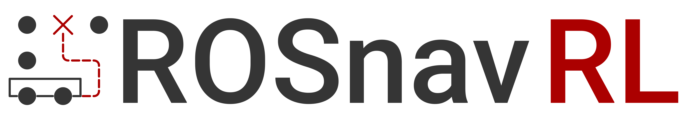

# Rosnav - ROS Navigation

This is the official **Rosnav** package. It contains trained
neural network designed for collision avoidance and the
infrastructure to run said networks in a **ROS** context.

Rosnav is especially designed to run in the **arena-rosnav**
environment. That means, it is training in there and the
evaluation of rosnav is already implemented in both the
2D and the 3D **arena-rosnav** derivates.

## Structure

The **Rosnav** package contains multiple different pretrained
neural networks for a bunch of robots. It also contains
encoders to integrate the models into existing infrastructures
with ease. It **does not** contain the necessary complete
infrastructure to train models, though, one can use
[arena-rosnav](https://github.com/Arena-Rosnav/arena-rosnav) to train a new model.

## Architectures

We provide two seperate architectures with different observation
and action spaces to use. Though, one can add a different
architecture relatively easy.

### Robot Specific Architecture

The first architecture is robot specific. Therefore each robot
has its own network and the networks have different observation
and action spaces.

#### Observation Space

The observation space is a linear vector. The first part of the
vector is the current laser observation. The laser scan is
concatenated with the distance and angle to the current goal.
At last, the action of the previous prediction is passed into the
network. Summarized, the observation space has the following
structure:

```
<current_laser_scan>, <theta_goal, distance_goal>, <last_y_vel, last_y_vel, last_anglular_vel>
```

Since the amount of laser scans is different for each robot,
we call the architecture **robot specific**.

#### Action Space

The action space is a 1D array with either two or three elements.
If the robot is holonomic, the array will have three elements,
otherwise it will have a length of two. The action space has
the following structure:

```
<x_vel>, <y_vel>, <anglular_vel>
```

### Unified Architecture

> The unified architecture is still work in progress.

The idea of the unified architecture is that a single model
can run on multiple different robots. Therefore, the observation
space is unified and the action space is always the same. Big
advantage of this architecture is that one does not have to train
a new network for each robot if small changes are made.

#### Observation Space

The observation space is the concatenation of a manipulated laser
scan, the current distance and angle to the goal, the last action,
and the minimal and maximal velocity the current robot can drive.

To make the unified architecture work, an encoder is used as a
middleware between model and environment. The encoders are explained
later in this overview.

The laser scan of each robot is rotated and interpolated to have 1200
entries.

The observation space has the following structure:

```
<encoded_laser_scan>, <theta_goal, distance_goal>, <last_x_vel, last_y_vel, last_angular_vel>, <min_x_vel, max_x_vel>, <min_y_vel, max_y_vel>, <min_angular_vel, max_angular_vel>, <robot_radius>
```

#### Action space

The action space is always a 1D array with three entries. Each entry
is in the interval [-1, 1]

## Rosnav Space Encoder

The **Rosnav Space Encoder** is designed as middleware to encode
observations into desired observation arrays for the different
architectures.

Currently we have space encoders for the **Unified Architecture**
and for the **Robot Specific Architecture**.

The space encoder offers the following functions:

#### get_observation_space()

Returns the shape of the observation space for the current
robot and Rosnav.

#### get_action_space()

Returns the shape of the action space for the current robot
and Rosnav.

#### decode_action(action)

Returns the decoded action based on the action calculated by
the network.

The action is a tuple of two or three values. Two values are used for non holonomic robots. The action will always be returned in the format [x_vel, y_cal, anglular_velocity]

#### encode_observation(observation)

Returns the encoded observation that is fed into the network.

The observation is a dictionary containing following keys:

- __laser_scan__: Array of current laser scan values
- __goal_in_robot_frame__: Tuple of (rho, theta) with distance and angle to the current goal
- __last_action__: Last action as array of three values

### Rosnav Space Manager

To make things really simple, we offer a seperate Rosnav
space manager who will instantiate the encoder. The manager
offers the same functions.

The used encoder is selected based on the `space_encoder` parameter.
Currently the parameter works for following values:

- "RobotSpecificEncoder": Will load the robot specific encoder
- "UniformSpaceEncoder": Will load the unified space encoder

### Required Parameters

The Rosnav space encoder needs to have some parameters set up
to work properly:

| **Parameter Name**       | **Description**                                              |
| ------------------------ | ------------------------------------------------------------ |
| laser/num_beams          | Number of laser scans                                        |
| laser/range              | Range of the laser scan                                      |
| laser/angle/min          | Start angle of the laser scan                                |
| laser/angle/max          | End angle of the laser scan                                  |
| laser/angle/increment    | The amount the angle is incremented between each scan        |
| robot_radius             | Radius of the roboter                                        |
| space_encoder            | Name of the encoder to use                                   |
| is_action_space_discrete | Wether you want to use a discrete or continuous action space |
| actions/discrete         | Actions for the discrete action space                        |
| actions/continuous       | Actions for the continuous action space                      |

In our (simulation setup package)[TODO] you can find yaml files
in which above values are already defined for a lot of robots.
We highly recommend using these predefined files as rosparam
files in your launch files.

### Usage For Training

As an example of the usage, the integration into our trainins
environment is described here.

Our training is based on [gym](TODO) and [flatland](TODO). Therefore, we have
a seperate environment for flatland deriving from gym. This
environment should offer the action and observation space as
well as a step and reset function. A sample usage of the
encoder could look like this:

```python
def Environment(gym.Env):
  def __init__(self, *args, **kwargs):
    ... # Some code here

    self.encoder = RosnavSpaceManager()

    self.action_space = self.encoder.get_action_space()
    self.observation_space = self.encoder.get_observation_space()

    ... # Some code here
```

This will load the Rosnav space manager in a variable `encoder`.
The real Rosnav space encoder is selected based on the parameter
`space_encoder`. The encoder is also used in the step and
reset function to encode observations and decode actions:

```python
...
  def step(self, action):
    action = self.encoder.decode_action(action)

    ... # Do something here

    observation = self.encoder.encode_observation(observation)

    return observation, reward, done, info

  def reset(self):
    ... # Do somthing here

    return self.encoder.encode_observation(observation)
```

### Usage For Testing

For testing we provide a node. The node requires the same params as described above and offers a service call `rosnav/get_action` to get the next action from a given observation. The message sent to the service has to be a `GetAction`-Message and contains above mentioned observations.


