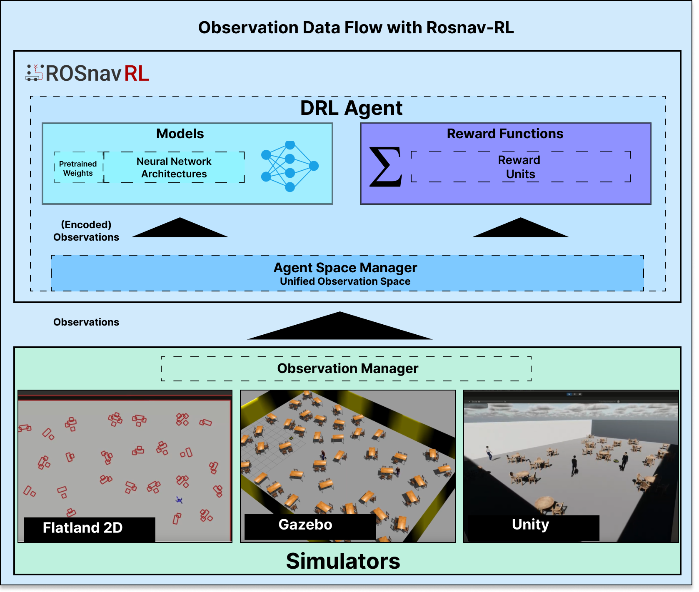

# RosNav-RL Developer Guide

<p align="center">
  
</p>

> Welcome to the RosNav-RL Developer Guide! This document provides a deep dive into the framework's architecture, core concepts, and development workflows. It's intended for developers who want to **extend the framework, create custom agents, or integrate new reinforcement learning algorithms.**
>
> While the main [README.md](../README.md) offers a high-level overview, this guide provides the detailed technical information you need to build on top of RosNav-RL.

## 📚 Table of Contents
- [Executive Summary](#1-executive-summary)
- [Project Architecture](#2-project-architecture)
- [Setup & Installation](#3-setup--installation)
- [Code Organization](#4-code-organization)
- [Core Concepts and Abstractions](#5-core-concepts-and-abstractions)
- [Development Workflow](#6-development-workflow)
- [Common Tasks & Tutorials](#-7-common-tasks--tutorials)

---

## 🎯 1. Executive Summary

### Project Purpose
**Rosnav-RL** is a powerful and flexible framework designed to accelerate the research and development of deep reinforcement learning-based navigation systems for mobile robots in ROS 2. Developing and testing RL agents for robot navigation is a complex task that often involves tightly coupled components and significant integration overhead. This framework was built to solve that problem.

It provides a **highly modular, framework-agnostic, and extensible toolkit** that simplifies the entire development pipeline—from agent design and training to deployment and testing. By offering a unified interface for different RL libraries (like Stable-Baselines3 and DreamerV3), standardized spaces, and plug-and-play components, Rosnav-RL empowers developers to focus on innovation rather than integration.

While initially developed for the [Arena-Rosnav](https://github.com/Arena-Rosnav/arena-rosnav) simulation platform, its adaptable architecture allows for easy integration into a wide variety of robotic systems and simulation environments.

<p align="center">
  
</p>

### Main Technologies
- **ROS 2**: The backbone for communication, providing a standardized interface for robotic systems.
- **Python 3**: The core programming language, chosen for its rapid development and extensive scientific libraries.
- **PyTorch**: The primary deep learning library, offering flexibility and performance for building custom neural networks.
- **Stable-Baselines3 & DreamerV3**: Integrated, state-of-the-art RL frameworks that serve as powerful, interchangeable backends for training agents.

### ✨ Key Features
- **Framework-Agnostic RL Backend**: Don't get locked into one library. A common interface allows you to seamlessly switch between different RL frameworks like Stable-Baselines3 and DreamerV3 to find the best algorithm for your task.
- **Deeply Modular & Extensible**: Build custom agents with ease. Every component—from observation spaces and reward functions to network layers—is a plug-and-play module. This design encourages rapid prototyping and experimentation.
- **Unified & Composable Spaces**: Tame the complexity of sensor data. Define complex observation spaces by simply combining smaller, reusable units. The framework automatically handles data collection and encoding.
- **Type-Safe & Validated Configuration**: Eliminate frustrating runtime errors. Configurations are managed through Pydantic, providing auto-completion, static type checking, and validation, making your experiments robust and reproducible.
- **Seamless ROS 2 Deployment**: Bridge the gap from simulation to reality. A built-in ROS 2 Action Server makes deploying your trained agent as simple as launching a node, enabling immediate integration into larger robotic systems.

---

## 🏗️ 2. Project Architecture

### Architectural Philosophy
The core philosophy of RosNav-RL is **modularity and separation of concerns**. The architecture is designed to decouple the main pillars of a reinforcement learning system, allowing you to modify or replace any part with minimal impact on the others. This includes:

-   🧠 **Reinforcement Learning Framework**: The "brain" of the agent, which can be swapped out (e.g., Stable-Baselines3, DreamerV3).
-   🔭 **Observation Handling**: The "eyes" of the agent, responsible for collecting and processing sensor data.
-   🚀 **Space Management**: The translator between the world and the agent's brain, encoding observations and decoding actions.
-   🎁 **Reward Calculation**: The "motivation" of the agent, defining its goals and providing feedback.
-   ⚙️ **Parameter Management**: A centralized and type-safe system for configuring every aspect of the agent and training process.

### Key Components
The framework is organized into three primary modules, as illustrated below:

<p align="center">
  
</p>

-   **🤖 RL Agent**: The core decision-making entity.
    -   **Model Architecture**: The neural network itself (policy, value function, etc.).
    -   **Space Manager**: Handles the agent's specific `Action` and `Observation` spaces.
    -   **Reward Function**: A collection of `RewardUnits` that computes the reward signal.

-   **👀 Observations**: Manages all incoming data from the environment.
    -   **Observation Manager**: Orchestrates the collection and generation of data.
    -   **Observation Units**: Individual modules for subscribing to topics (`Collectors`) or deriving new data (`Generators`).

-   **📊 States**: Pydantic-based containers for structured, type-safe state management.
    -   **Simulation State Container**: Holds global information about the environment (e.g., robot pose, goal).
    -   **Agent State Container**: Holds agent-specific information derived from the simulation state.

### Data Flow
The data flows through the system in a clear, sequential pipeline from sensor input to robot action.

<p align="center">
  
</p>

1.  **📥 Input: Sensor Data Collection**
    -   **Component**: `ObservationManager`
    -   **Function**: Collects raw data from various ROS 2 topics (e.g., laser scans, odometry) and organizes it into a structured `ObservationDict`.

2.  **🧠 Processing: Observation Encoding**
    -   **Component**: `ObservationSpaceManager`
    -   **Function**: Takes the raw `ObservationDict` and transforms it into a format the agent's neural network can understand. This involves selecting, normalizing, and stacking observations according to the agent's configuration.

3.  **🤖 Decision: Action Selection**
    -   **Component**: `RL_Model` (Policy Network)
    -   **Function**: The encoded observation is fed into the neural network, which outputs an action based on its learned policy.

4.  **🚀 Output: Action Decoding**
    -   **Component**: `ActionSpaceManager`
    -   **Function**: The raw action from the model (often a continuous value) is decoded into a concrete command that the robot can execute (e.g., `Twist` message with linear and angular velocities).

5.  **⚙️ Execution: Robot Command**
    -   **Component**: Robot Hardware/Simulator
    -   **Function**: The final command is sent to the robot for execution in the physical or simulated world.

---

## 🚀 3. Setup & Installation

This section covers how to set up your development environment.

### Prerequisites
- Working ROS 2 Humble installation
- Python 3.8+
- Poetry

### Environment Setup
For development, it's recommended to clone the repository into your ROS 2 workspace.

1.  **Clone the repository into your `src` folder:**
    ```bash
    cd /path/to/your/colcon_ws/src
    git clone https://github.com/Arena-Rosnav/rosnav-rl.git
    ```

2.  **Install dependencies using Poetry:**
    Navigate to the `rosnav_rl` package directory. Poetry will create a virtual environment and install all necessary Python packages.
    ```bash
    cd rosnav-rl/rosnav_rl
    poetry install
    ```

3.  **Build the workspace:**
    Return to your workspace root and build the packages.
    ```bash
    cd /path/to/your/colcon_ws
    colcon build --packages-select rosnav_rl rosnav_rl_msgs
    ```
4.  **Source the workspace:**
    ```bash
    source install/setup.bash
    ```
---

## 📂 4. Code Organization

### Directory Structure
```
agents/             # Agent storage
launch/             # ROS launch files
reward/             # Reward functions
rosnav_rl/
├── action_server/    # ROS action server implementation
├── cfg/             # Configuration management
├── model/           # RL model implementations
├── observations/    # Observation handling
├── reward/         # Reward system
├── spaces/         # Action and observation spaces
├── states/         # State management
└── utils/          # Utility functions
```

---

## 🤖 5. Core Concepts and Abstractions

This section breaks down the core building blocks of the RosNav-RL framework. Each component is designed to be modular and extensible, allowing you to customize any part of the agent's behavior.

### 🧠 The Agent: The Brain of the Operation
-   **`RL_Agent`**: The master conductor. This class brings all the other components together—the model, the spaces, and the reward function—to form a complete, functioning agent. It's the main entry point for training and inference.
    -   *File*: [`rosnav_rl/rl_agent.py`](rosnav_rl/rl_agent.py)
-   **`RL_Model`**: The pluggable brain. This is an abstract interface that wraps different reinforcement learning libraries (like Stable-Baselines3 or DreamerV3). Want to use a new RL framework? Just implement this interface, and it will seamlessly integrate with the rest of the system.
    -   *File*: [`rosnav_rl/model/model.py`](rosnav_rl/model/model.py)

### 🔭 Perception: How the Agent Senses the World
-   **`ObservationManager`**: The central nervous system for sensory input. It orchestrates all `ObservationUnits` to collect data from the environment (e.g., laser scans, odometry) and prepares it for the agent.
    -   *File*: [`rosnav_rl/observations/observation_manager.py`](rosnav_rl/observations/observation_manager.py)
-   **`ObservationCollectorUnit`**: The eyes and ears. These units subscribe to specific ROS 2 topics, grab the raw data, and perform any initial preprocessing. Each collector is a self-contained module for a single sensor.
    -   *File*: [`rosnav_rl/observations/collectors/base_collector.py`](rosnav_rl/observations/collectors/base_collector.py)
-   **`ObservationGeneratorUnit`**: The creative mind. These units don't subscribe to topics but instead derive new, meaningful data from observations that have already been collected (e.g., calculating the time to collision from laser scans).
    -   *File*: [`rosnav_rl/observations/generators/base_generator.py`](rosnav_rl/observations/generators/base_generator.py)

### 🚀 Action & Observation Spaces: The Agent's Worldview
-   **`BaseSpaceManager`**: The universal translator. This crucial component sits between the environment and the RL model, handling the vital tasks of encoding observations into a format the model understands and decoding the model's output into executable robot commands.
    -   *File*: [`rosnav_rl/spaces/space_manager/base_space_manager.py`](rosnav_rl/spaces/space_manager/base_space_manager.py)
-   **`ObservationSpaceManager`**: Defines *what the agent sees*. It's built from a collection of `BaseObservationSpace` modules, each corresponding to a piece of sensory data (e.g., a laser scan, the robot's velocity). You can mix and match these modules to construct complex, customized observation spaces for your agent.
    -   *File*: [`rosnav_rl/spaces/observation_space/observation_space_manager.py`](rosnav_rl/spaces/observation_space/observation_space_manager.py)
-   **`ActionSpaceManager`**: Defines *what the agent can do*. It translates the abstract actions from the policy network (e.g., an array `[-0.5, 0.8]`) into concrete, discrete, or continuous commands for the robot.
    -   *File*: [`rosnav_rl/spaces/action_space/action_space_manager.py`](rosnav_rl/spaces/action_space/action_space_manager.py)

### 🎁 The Reward System: The Agent's Motivation
-   **`RewardFunction`**: The scorekeeper. This class orchestrates a collection of individual `RewardUnit`s, summing their outputs to calculate the final reward signal at each step. This composite structure makes it easy to build complex, multi-objective reward functions.
    -   *File*: [`rosnav_rl/reward/reward_function.py`](rosnav_rl/reward/reward_function.py)
-   **`RewardUnit`**: A single piece of motivation. Each unit is a self-contained module that calculates a specific reward or penalty (e.g., "reward for reaching the goal," "penalty for colliding"). You can combine these units like building blocks to shape the agent's behavior.
    -   *File*: [`rosnav_rl/reward/base_reward_units.py`](rosnav_rl/reward/base_reward_units.py)

### 📊 State Management: The Single Source of Truth
-   **`SimulationStateContainer` & `AgentStateContainer`**: The memory banks. These Pydantic-based data containers provide a structured, type-safe way to manage and access state information throughout the framework. The `SimulationStateContainer` holds global environment data, while the `AgentStateContainer` holds data specific to an individual agent.
    -   *Files*: [`rosnav_rl/states/simulation/container.py`](rosnav_rl/states/simulation/container.py), [`rosnav_rl/states/agent/container.py`](rosnav_rl/states/agent/container.py)

### 🌐 Deployment: From Training to Reality
-   **`ActionServer`**: The bridge to the ROS 2 world. This component wraps a trained agent in a ROS 2 Action Server, making it instantly deployable. Other nodes can request actions from your agent, allowing for easy integration into larger robotic systems.
    -   *File*: [`rosnav_rl/action_server/base_server.py`](rosnav_rl/action_server/base_server.py)

## 🛠️ 6. Development Workflow

### Training a Custom Agent
The typical workflow for training an agent involves creating a custom `gym.Env` that interfaces with your simulation environment.

1.  **Create a Gym Environment**:
    -   Inherit from `gym.Env`.
    -   In the `__init__`, instantiate the `ObservationManager`, `BaseSpaceManager`, and `RewardFunction`.
    -   Implement the `step`, `reset`, `render`, and `close` methods.
    -   The `step` method will use the `ObservationManager` to get new sensor data, pass it to the agent to get an action, and use the `RewardFunction` to calculate the reward.

2.  **Configure Your Agent**:
    -   Define your agent's configuration using the Pydantic models (e.g., `AgentCfg`, `StableBaselinesCfg`). This includes specifying the model architecture, observation spaces, and hyperparameters.

3.  **Write a Training Script**:
    -   Instantiate your custom environment.
    -   Instantiate the `RL_Agent` with your configuration.
    -   Call the `agent.train()` method, passing in your environment.

### Deployment
Once an agent is trained, it can be deployed using the ROS 2 Action Server.

-   A launch file is provided to start the server with your trained agent's model.
-   The server listens for requests on the `/rosnav_rl/get_action` service.
-   An external node can request an action by calling this service, providing the necessary observation data if required by the agent's configuration. The server then returns the computed action.

```python
# Example of a ROS 2 node calling the action service
import rclpy
from rosnav_rl_msgs.srv import GetAction

# Initialize rclpy and create a node
rclpy.init()
node = rclpy.create_node('action_requester')

# Create a client for the service
# Replace 'sim_1' with the appropriate namespace if used
client = node.create_client(GetAction, "/sim_1/rosnav_rl/get_action")

# Wait for the service to be available
while not client.wait_for_service(timeout_sec=1.0):
    node.get_logger().info('Service not available, waiting again...')

# Create a request and call the service
request = GetAction.Request()
future = client.call_async(request)
rclpy.spin_until_future_complete(node, future)

if future.result() is not None:
    action = future.result().action
    node.get_logger().info(f'Received action: {action}')
else:
    node.get_logger().error('Exception while calling service: %r' % future.exception())

# Clean up
node.destroy_node()
rclpy.shutdown()
```

---

## 🎓 7. Common Tasks & Tutorials

Here are guides for common development tasks. For more details, check the documentation within each submodule.
- [Reward Functions](rosnav_rl/reward/reward_functions.md)
- [Observation Spaces](rosnav_rl/spaces/spaces.md)

> #### 🧩 **Tutorial: Adding a New RL Framework**
> To integrate a new RL library (e.g., "MyRLFramework"), you need to create a new model interface.
> 1.  **Implement a new `RL_Model`**: Inherit from the base class and implement the abstract methods for training, saving, loading, and action selection according to your new framework's API.
> 2.  **Define Architectures**: Implement your network architectures (e.g., policies, critics) compatible with the new framework.
> 3.  **Create Pydantic Configurations**: Define new configuration classes for all settings and hyperparameters of the new framework.
> 4.  **Update the Action Server**: For deployment, you may need to create a new action server class that inherits from the base server and handles your new model.

> #### 🧩 **Tutorial: Training a New Agent**
> For a complete, working example of a training pipeline, we highly recommend checking out the **[Arena-Rosnav](https://github.com/Arena-Rosnav/arena-rosnav)** repository and its [documentation](https://arena-rosnav.readthedocs.io/en/latest/). The code snippet below illustrates the core components involved in a typical training script.
> ```python
> import rosnav_rl
> 
> # 1. Create a configuration for the agent and RL framework
> # (Here, we use DreamerV3 as an example)
> config = rosnav_rl.model.dreamerv3.cfg.DreamerV3Cfg(...)
> 
> agent_cfg = rosnav_rl.AgentCfg(
>     name="my_dreamer_agent",
>     robot="jackal",
>     framework=config,
> )
> 
> # 2. Create state containers
> # SimulationStateContainer holds global simulation info
> simulation_state_container = rosnav_rl.SimulationStateContainer(...)
> # AgentStateContainer holds agent-specific info
> agent_state_container = simulation_state_container.to_agent_state_container()
> 
> # 3. Create the agent instance
> agent = rosnav_rl.RL_Agent(
>     agent_cfg=agent_cfg,
>     agent_state_container=agent_state_container
> )
> agent.initialize_model()
> 
> # 4. Create Gym environments for training and evaluation
> # The `create_env` function is a helper you would write to instantiate
> # your custom gym.Env, which handles the interaction with the simulator.
> train_envs = [create_env("train", i) for i in range(config.general.envs)]
> eval_envs = [create_env("eval", i) for i in range(config.general.envs)]
> 
> # 5. Start the training process
> agent.train(
>     train_envs=train_envs,
>     eval_envs=eval_envs
> )
> ```

> #### 🧩 **Tutorial: Adding New Model Architectures**
> The process for adding a new network architecture (e.g., a custom policy or feature extractor) depends on the RL framework you are using. Please refer to the framework-specific guides for detailed instructions.
> - [StableBaselines3 Custom Policies Guide](rosnav_rl/model/stable_baselines3/custommodel.md)
> - [DreamerV3 Model Details](rosnav_rl/model/dreamerv3/package_description.md)

> #### 🧩 **Tutorial: Adding a New Observation Space**
> To add a new type of observation (e.g., from a new sensor), you create a new `BaseObservationSpace`.
> 1. Inherit from `BaseObservationSpace`.
> 2. Register it with the `SpaceFactory` using a unique name.
> 3. Set the `required_observation_units` attribute to specify which `ObservationCollectorUnit`s are needed.
> 4. Implement `get_gym_space` to define the shape and type of the observation.
> 5. Implement `encode_observation` to process the raw data from the `ObservationDict` into a NumPy array for the model.
>
> ```python
> from rosnav_rl.observations.collectors import LaserCollector
>
> @SpaceFactory.register("laser")
> class LaserScanSpace(BaseObservationSpace):
>     name = "LASER"
>     required_observation_units = [LaserCollector]
> 
>     def __init__(self, laser_num_beams: int, laser_max_range: float, *args, **kwargs):
>         # ...
> 
>     def get_gym_space(self) -> spaces.Space:
>         # Define the gym space, e.g., Box(low=0, high=1, shape=(laser_num_beams,))
>         # ...
> 
>     @BaseObservationSpace.apply_normalization
>     def encode_observation(self, observation: ObservationDict, *args, **kwargs) -> np.ndarray:
>         # Access the collected laser scan data and return it as a numpy array.
>         return observation[LaserCollector.name]
> ```

> #### 🧩 **Tutorial: Adding a New Observation Unit**
> `ObservationUnit`s are responsible for fetching and processing data.
> - **`ObservationCollectorUnit`**: Subscribes to a ROS 2 topic to get raw sensor data. You must implement the `preprocess` method to convert the ROS message into a more usable format (e.g., a NumPy array).
> - **`ObservationGeneratorUnit`**: Creates new types of observations from data that has already been collected. You must implement the `generate` method.
>
> ```python
> # Collector Example: Gets LaserScan messages and extracts ranges.
> class LaserCollector(ObservationCollectorUnit[sensor_msgs.msg.LaserScan, np.ndarray]):
>     name: ClassVar[str] = "laser_scan"
>     topic: ClassVar[str] = "scan"
>     # ...
>     def preprocess(self, msg: sensor_msgs.msg.LaserScan) -> np.ndarray:
>         return np.array(msg.ranges, dtype=np.float32)
> 
> # Generator Example: Calculates the distance to the closest obstacle.
> class MinDistanceGenerator(ObservationGeneratorUnit[float]):
>     name: ClassVar[str] = "min_obstacle_dist"
>     requires: ClassVar[List[BaseUnit]] = [LaserCollector]
>     # ...
>     def generate(self, obs_dict: ObservationDict, ...) -> float:
>         laser_scan = obs_dict[LaserCollector.name]
>         return np.min(laser_scan)
> ```

> #### 🧩 **Tutorial: Adding a New Reward Component**
> To create a custom reward, you inherit from `RewardUnit` and register it with the `RewardUnitFactory`. The `__call__` method contains the logic for calculating the reward. You can then add this component to your agent's reward function configuration.
> ```python
> @RewardUnitFactory.register("goal_reached_reward")
> class GoalReachedReward(RewardUnit):
>     def __call__(self, state_container: SimulationStateContainer, *args, **kwargs):
>         if state_container.goal_reached:
>             self.add_reward(100.0)
>             self.add_info({"goal_reached": True})
>         else:
>             self.add_reward(0.0)
> ```